  

   

  
  
  

## Привет! Мы — Manacost Dev 👋

Команда энтузиастов из Варшавы, которая превращает любовь к **Hearthstone** в полезные продукты: игровые сервисы, Telegram-ботов, WordPress-инструменты и AI-автоматизацию.

Нам нравится собирать цельные системы — от парсеров и API до интерфейсов, контента и доставки в продакшен.

### Что мы создаём

<table>
  <tr>
    <td width="50%" valign="top">
      <h3>🧩 <a href="https://github.com/Zulut30/Wordpress-skills">WordPress Skills</a></h3>
      
Профессиональный Agent Skill для разработки, аудита, тестирования и выпуска современных WordPress-плагинов.

    </td>
    <td width="50%" valign="top">
      <h3>🤖 <a href="https://github.com/Zulut30/newslatter-bot">AI News Aggregator</a></h3>
      
Telegram-агрегатор новостей про AI: фильтрация, рерайт, импорт из X, Reddit и GitHub, плюс еженедельный дайджест.

    </td>
  </tr>
  <tr>
    <td width="50%" valign="top">
      <h3>🃏 <a href="https://github.com/Zulut30/deckview-telegram-bot">DeckView Bot</a></h3>
      
Telegram-бот и HTTP API для распознавания кодов и визуализации колод Hearthstone.

    </td>
    <td width="50%" valign="top">
      <h3>✨ <a href="https://github.com/Zulut30/premium-telegram-emoji">Premium Telegram Emoji</a></h3>
      
Каталог 275+ premium emoji с ID, превью, ботом для пополнения и автодеплоем на GitHub Pages.

    </td>
  </tr>
  <tr>
    <td width="50%" valign="top">
      <h3>🔐 <a href="https://github.com/Zulut30/kolodaheartstone-auth">VIP Access</a></h3>
      
WordPress-плагин и aiogram-бот с magic-link авторизацией и проверкой подписки для премиум-контента.

    </td>
    <td width="50%" valign="top">
      <h3>🏟️ <a href="https://github.com/Zulut30/manacost-arena">Manacost Arena</a></h3>
      
Современный сайт об Арене Hearthstone от команды Manacost.

    </td>
  </tr>
</table>

### Технологии

### GitHub в цифрах

  
   
  
  

---

  Открыты к идеям, коллаборациям и новым способам сделать любимые игры удобнее.

