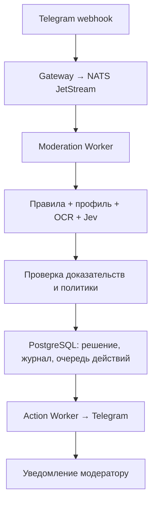

# AntiSpamBee — модерация Telegram с TypeSafe Jev

**Go · PostgreSQL · NATS JetStream · TypeSafe Jev · Tesseract OCR**

[Исходный код](https://github.com/Manacost-Labs/AntiSpamBee) · [Профиль](https://github.com/Zulut30)

## Задача и результат

Создал AntiSpamBee за один вечер: Telegram-бота для обнаружения рекламы и спама, анализа контекста и выполнения действий модерации. Проект объединяет правила, распознавание текста на изображениях и модель TypeSafe Jev.

В моей проверке примерно на **156 спам-ботах обнаружены все — 100% этой выборки**. Результат относится к этой проверке; отдельная оценка ложных срабатываний на обычных пользователях здесь не приводится.

## Что анализирует система

| Канал | Как используется |
| :--- | :--- |
| Сообщения и подписи | Правила распознают рекламные предложения, ссылки и попытки скрыть слова смешением символов. |
| Изображения сообщений | Локальный Tesseract извлекает русский и английский текст; результат поступает в анализ сообщения. |
| Профиль и личный канал | Отдельный детектор проверяет bio, username, описание и доступные последние публикации личного канала. |
| Поведение | Повторы, частота сообщений и история нарушений формируют дополнительные сигналы для проверки. |
| Смысл сообщения | Jev определяет наличие активной рекламы, категорию и фрагмент текста, который подтверждает решение. |

В опубликованной версии OCR обрабатывает изображения сообщений. Отдельная загрузка и анализ аватарок в проверенном коде не реализованы. Сигнал профиля сам по себе не разрешает автоматическое удаление сообщения.

## Как встроен Jev

Интеграция использует OpenRouter Decisions API и модель [`~typesafe/jev-latest`](https://openrouter.ai/~typesafe/jev-latest/). Это алиас актуальной модели семейства Jev; фактически использованная версия сохраняется вместе с результатом.

Модель получает текст сообщения, подпись, OCR и ссылки. Она возвращает структурированные оценки: наличие рекламы, категорию, силу доказательства и выбранный фрагмент исходного текста. Профиль автора не включается в запрос Jev.

Ответ проходит проверки перед действием. Отсутствующий фрагмент, слабое доказательство или противоречие между ответами не разрешают удаление только на основании оценки модели. Финальное действие определяет отдельный модуль правил.

## Архитектура

## Надёжность и контроль действий

- **Разделение обработки и исполнения.** Получение события, анализ и обращение к Telegram выполняют отдельные процессы.
- **Защита от повторов.** Входные события дедуплицируются по `update_id`; действия имеют ключи идемпотентности.
- **Восстановление после ошибок.** Предусмотрены повторные попытки, учёт Telegram `retry_after`, временное закрепление задания за исполнителем и очередь необработанных ошибок.
- **Проверяемые решения.** Журнал хранит сигналы, фрагмент доказательства, версию политики и сведения о модели. Модератор получает причину удаления.
- **Ограничение автоматизации.** Текущая политика разрешает автоматическое удаление при достаточных доказательствах в сообщении. Автоматические баны отключены; ручные команды модератора проверяют его права.

## Подтверждение в репозитории

Проверенная версия: [`900925e`](https://github.com/Manacost-Labs/AntiSpamBee/commit/900925e19deb5453d6e1ee716f3896d86f2dba91). [CI этого коммита завершился успешно](https://github.com/Manacost-Labs/AntiSpamBee/actions/runs/35526354581): интеграционные тесты с PostgreSQL, `go test -race`, `go vet` и сборка сервисов.

- [Интеграция Jev и проверка ответа](https://github.com/Manacost-Labs/AntiSpamBee/blob/900925e19deb5453d6e1ee716f3896d86f2dba91/internal/openrouter/client.go).
- [Анализ профиля](https://github.com/Manacost-Labs/AntiSpamBee/blob/900925e19deb5453d6e1ee716f3896d86f2dba91/internal/detection/profile.go).
- [OCR изображений](https://github.com/Manacost-Labs/AntiSpamBee/blob/900925e19deb5453d6e1ee716f3896d86f2dba91/internal/mediaocr/extractor.go).
- [Правила разрешения действий](https://github.com/Manacost-Labs/AntiSpamBee/blob/900925e19deb5453d6e1ee716f3896d86f2dba91/internal/moderation/decision.go).
- [Методика оценки качества](https://github.com/Manacost-Labs/AntiSpamBee/blob/900925e19deb5453d6e1ee716f3896d86f2dba91/docs/detection-quality.md).

Успешный CI подтверждает прохождение инженерных проверок. Точность обнаружения и стабильность в эксплуатации измеряются отдельно на реальных данных.
