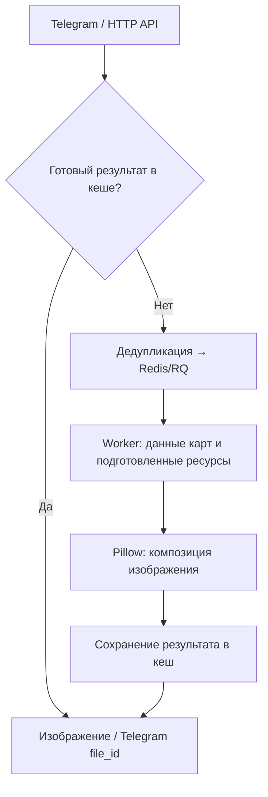

# DeckView — генерация изображений для Telegram и веб-приложений

**Python · Pillow · Flask · aiogram · Redis / RQ · Nginx**

[Исходный код](https://github.com/Manacost-Labs/Deckview-TG) · [Telegram-бот](https://t.me/manacostcard_bot) · [Профиль](https://github.com/Zulut30)

## Задача и мой вклад

Разработал общий конвейер генерации изображений колод Hearthstone для Telegram и HTTP API. Пользователь передаёт код колоды и настройки оформления, а сервис получает данные карт, собирает изображение и возвращает результат.

Тяжёлую обработку вынес в фоновые задачи. Реализовал персонализацию изображений, кеширование с учётом версий данных, дедупликацию запросов и проверки регрессий оформления.

## Основные инженерные решения

| Задача | Решение |
| :--- | :--- |
| Не блокировать обработчики бота и API | Рендер выполняют отдельные Redis/RQ workers с предварительной загрузкой каталога и ресурсов. |
| Не пересчитывать одинаковые изображения | Одновременные одинаковые запросы дедуплицируются; повторные обращения используют готовый результат. |
| Обновлять кеш при изменении оформления | Ключ включает колоду, настройки дизайна, отпечатки пользовательских ресурсов и версии рендера, шаблонов и данных карт. |
| Уменьшить повторные загрузки | Кешируются подготовленные изображения карт, готовые JPEG и Telegram `file_id`. |
| Поддерживать несколько клиентов | Telegram и HTTP API используют общие сервисы данных и рендера. |
| Сохранять корректность изображения | Проверяются эталонные колоды на 30 и 40 карт, отдельный учёт sideboard и инварианты размещения карточек. |

## Путь запроса

Workers можно масштабировать независимо от процессов бота и веб-сервиса. Время получения данных, подготовки изображений и композиции измеряется по отдельным этапам.

## Что получает пользователь

Код колоды превращается в изображение с выбранным оформлением: классическим, пергаментным или пользовательским. Поддерживаются фоны, градиенты, шрифты, манакривая, стоимость колоды и дополнительные карты. Один сервис предоставляет результат в Telegram и через HTTP API для интеграций с сайтами.

## Проверки и выпуск

В репозитории настроены архитектурные и регрессионные тесты. Есть отдельный прогон с генерацией эталонных изображений Reno-колод на 30 и 40 карт.

Скрипт выпуска создаёт отдельный релиз по SHA коммита, выполняет проверки и атомарно переключает текущую версию. При ошибке перезапуска или health-check предусмотрен возврат на предыдущий релиз.

[CI проверенного коммита завершился успешно](https://github.com/Manacost-Labs/Deckview-TG/actions/runs/31602371102). Это подтверждает прохождение проверок исходников; отдельная проверка развёрнутого сервиса в этот раз не выполнялась.

## Исследование производительности

В проекте также есть экспериментальный Rust-композитор и инструменты сравнения с Pillow. Измеряются холодные и прогретые прогоны, отдельно от сети и доставки в Telegram. Более позднее сравнение не показало устойчивого преимущества Rust; компонент остаётся экспериментальным и по умолчанию выключен.

## Подробности реализации

- [Архитектура и общий конвейер](https://github.com/Manacost-Labs/Deckview-TG/blob/b7484d809fadcc72e54210fd7e47d4c880f83247/docs/ARCHITECTURE.md).
- [Решение о кеше и границах workers](https://github.com/Manacost-Labs/Deckview-TG/blob/b7484d809fadcc72e54210fd7e47d4c880f83247/docs/decisions/0001-render-cache-and-worker-boundary.md).
- [HTTP API](https://github.com/Manacost-Labs/Deckview-TG/blob/b7484d809fadcc72e54210fd7e47d4c880f83247/docs/API.md).
- [Выпуск и откат](https://github.com/Manacost-Labs/Deckview-TG/blob/b7484d809fadcc72e54210fd7e47d4c880f83247/docs/DEPLOYMENT.md).
- [Эксперимент с Rust и результаты замеров](https://github.com/Manacost-Labs/Deckview-TG/blob/b7484d809fadcc72e54210fd7e47d4c880f83247/docs/NATIVE_RENDERER_EXPERIMENT.md).
