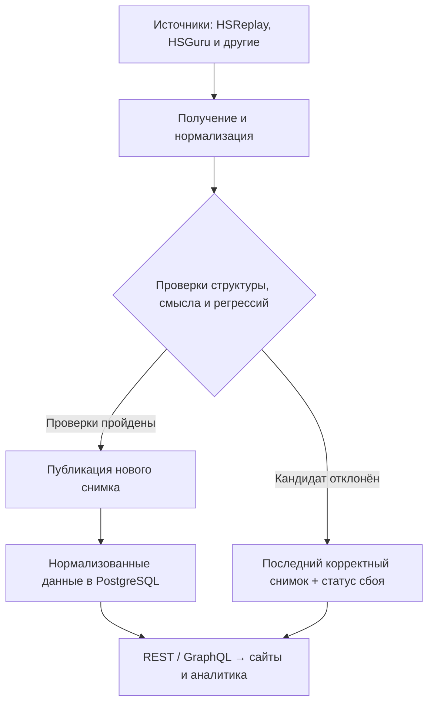

# От игровых данных к аналитике Hearthstone

**Сбор данных · Проверка качества · PostgreSQL · REST / GraphQL**

[Исходный код](https://github.com/Manacost-Labs/api.kolodahearthstone.com) · [Документация API](https://api.kolodahearthstone.com/docs) · [Профиль](https://github.com/Zulut30)

## Масштаб

**Миллионы матчей в неделю.** Система обрабатывает отдельные записи матчей и агрегированную статистику источников, сортирует данные и формирует аналитические выборки.

## Задача и мой вклад

Спроектировал систему парсинга и анализа данных Hearthstone: сбор из разных источников, сортировка и подготовка нужных аналитических выборок. Задача — превращать разрозненную игровую статистику в данные, которыми могут пользоваться сайты и другие сервисы.

У источников различаются форматы, периоды и условия обновления. После игрового патча меняются выборки; сетевой запрос может завершиться успешно, но вернуть неполные данные. Поэтому важная часть решения — проверка качества и свежести перед публикацией.

## Как устроен поток данных



Схема показывает основной путь статистики. Публикация файловых снимков и импорт в PostgreSQL — отдельные этапы. Каталог карт имеет собственную подсистему хранения.

## Основные инженерные решения

| Задача | Решение |
| :--- | :--- |
| Объединить разные форматы | Нормализация статистики по источнику, режиму, рангу, периоду и игровой сущности. Специфичные метрики сохраняются в JSONB. |
| Не публиковать повреждённый ответ | Проверки обязательных полей, числовых диапазонов, уникальности и полноты. HTTP 200 сам по себе не считается успехом. |
| Защитить работающие сервисы при сбое | Отклонённый кандидат не заменяет последний корректный снимок. Состояние попытки и свежесть доступных данных учитываются отдельно. |
| Корректно пережить игровой патч | Для ограниченного раннего периода предусмотрены отдельные правила и пометка предварительных данных. |
| Дать сервисам устойчивый интерфейс | Версионированные REST endpoints и GraphQL с фильтрами и пагинацией. |
| Видеть проблемы обновления | Расписания, ограничения времени выполнения, блокировки ресурсов и журнал результатов запусков. |

## Что получает потребитель

Колоды и архетипы, винрейты, статистику классов Арены и сущностей Полей сражений можно запрашивать через единый API. Нормализованный слой хранит историю снимков и позволяет выбирать данные по игровому контексту.

Потребителю доступны сведения об источнике и времени обновления. Это позволяет учитывать возраст статистики при её показе пользователям.

### Пример публичного запроса

```bash
curl -fsS 'https://api.kolodahearthstone.com/v1/arena/classes?limit=2'
```

Запрос проверен 22 сентября 2026 года. Ниже — сокращённый фрагмент полученного ответа; значения меняются по мере обновления источника.

```json
{
  "data": [
    { "class_ru": "Рыцарь смерти", "win_rate": 55.47 },
    { "class_ru": "Жрец", "win_rate": 52.74 }
  ],
  "meta": {
    "source_id": "hsreplay_arena_class_pages_firecrawl",
    "fetched_at": "2026-09-22T18:03:53.690754+02:00",
    "stale": false,
    "limit": 2,
    "offset": 0
  }
}
```

## Технические подробности

- [Архитектура и границы подсистем](https://github.com/Manacost-Labs/api.kolodahearthstone.com/blob/main/docs/ARCHITECTURE.md).
- [Проверки и публикация данных](https://github.com/Manacost-Labs/api.kolodahearthstone.com/blob/main/docs/PARSER_PIPELINE.md).
- [Решение о нормализованной статистике в PostgreSQL](https://github.com/Manacost-Labs/api.kolodahearthstone.com/blob/main/platform/docs/decisions/003-unified-game-statistics.md).
- [API и доступные аналитические выборки](https://github.com/Manacost-Labs/api.kolodahearthstone.com#graphql).
